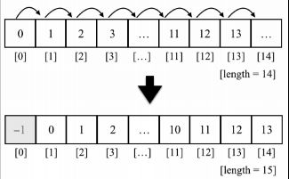
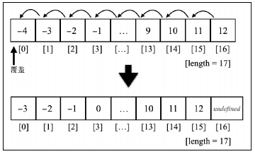

## 数组
数组存储一系列同一数据类型的值，虽然在js中，也可以在数组中保存不同的值，但是我们还是遵守最佳实践，避免这么做。

## 创建和初始化数组
```js
// 使用new关键字初始化和创建数组
let dayOfWeek = new Array();
// 创建指定长度的数组
dayOfWeek = new Array(7);
// 直接将数组元素作为参数传递给它的构造器
dayOfWeek = new Array('Sunday', 'Monday', 'Tuesday', 'Wednesday', 'Thursday', 'Friday', 'Saturday');
```

但是，使用new关键字并不是最好的方式，直接使用中括号（ [] ）这种形式更好。

```js
let dayOfWeek = [];
```

也可以使用一些元素初始化数组。

```js
let daysOfWeek = ['Sunday', 'Monday', 'Tuesday', 'Wednesday', 'Thursday', 'Friday', 'Saturday'];
```

如果想要知道数组的长度（它的大小），可以使用 length 属性

```js
console.log(daysOfWeek.length); // 7
```

### 访问元素和迭代数组

可以使用for循环来迭代数组，访问数组里面指定位置的元素

```js
for(let i = 0; i < daysOfWeek.length; i++) {
  console.log(dayOfWeek[i]);
}
```

### 添加元素

#### 在数组的末尾添加元素
假如我们有一个数组numbers， 初始化成了 0 到 9。

```js
let numbers = [0, 1, 2, 3, 4, 5, 6, 7, 8, 9];
```
如果想要在数组的末尾添加元素，比如（10），只要把值赋值给数组中最后一个空位上的元素即可。
```js
numbers[numbers.length] = 10;
```
>在js中，数组是一个可以修改的对象，如果添加元素，它就会动态增长，在C和java等其他语言中，我们要决定数组的大小，想要添加元素就要创建一个全新的数组，不能简单地往其中添加所需要的元素。

#### 使用push方法
使用push方法，使用push方法，我们能够添加任何元素。
```js
numbers.push(11);
numbers.push(12,13);
```
如果输出numbers的话，就会看到从0到13的值。


#### 在数组的开头插入元素

现在，我们希望在数组的开头插入一个新的元素（-1），不像之前那样插入到最后，而是放在数组的开头，为了实现这个需求，首先要腾出数组里面的第一个元素的位置，把所有的元素想右移动一位。我们可以循环数组中的元素，从最后一位（长度值就是数组的末尾）开始，将对应的前一个元素（i-1）的值赋值给它（i），依次处理，最后把我们想要的值赋值给第一个位置（索引0）上。我们可以将这段逻辑写成一个函数，甚至将该方法直接添加到Array的原型上，使得所有数组的实例都可以访问到这个方法。下面的代码表现了这段逻辑。

```js
Array.prototype.insertFirstPosition = function(value) {
  for (let i = this.length;i >= 0; i-- ) {
    this[i] = this.[i - 1];
  };
  this[0] = value;
}
numbers.insertFirstPosition(-1);
```

下图描述了刚才的操作过程。



#### 使用unshift方法

在JavaScript里，数组有一个方法叫做unshift,可以直接把数值插入数组的开头（此方法背后的逻辑和insertFirstPosition方法的行为是一样的）。

```js
numbers.unshift(-2);
numbers.unshift(-4,-3);
```
执行完上述操作之后，数组就会输出 -4到 13。

### 删除元素

目前为止，我们已经学习了如何给数组的开始和结尾位置添加元素。下面我们看一下怎样从数组中删除元素。

#### 从数组的末尾删除元素

要删除数组里最靠后的元素，可以使用pop方法

```js
numbers.pop();
```

> 通过push和pop方法，就能用数组来模拟栈，这部分内容会在栈这一部分介绍。

#### 从数组的开头删除元素

如果要移除数组的第一个元素，可以使用下面的代码。

```js
for (let i = 0; i < numbers.length; i++) {
  numbers[i] = numbers[i+1];
}
```

下图呈现了这段代码的执行过程。



我们把数组里面所有的元素都向左边移动了一位，但是数组的长度依然是17, 这意味着数组中有额外的一个元素（值是 undefined）,在最后一次循环里，i+1引用了数组里面还未初始化的一个位置。在java等一些语言里，这样写可能会抛出异常，因此不得不再 numbers.length-1处停止循环。

可以看到，我们只是把数组第一位的值用第二个位置覆盖了，并没有删除元素（因为数组的长度还是和原来一样的，并且多了一个未定义的元素）。


