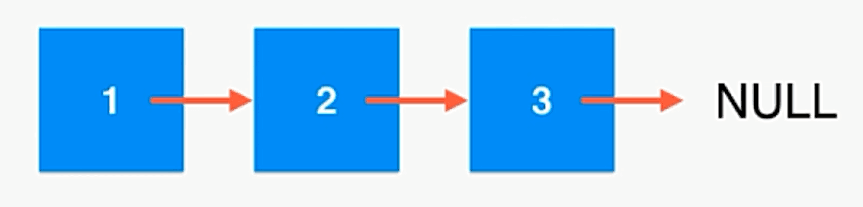

## 链表

链表存储有序元素的集合，但是不同于数组，链表中的元素在内存中并不是连续放置的。每个元素由一个存储元素本身
的节点和指向下一个元素的引用（也称为指针）数据存储在“节点”（Node）中

下图展示了一个链表的结构：



链表是一种真正的动态数据结构，不需要处理固定容量的问题

理解了链表的基本概念之后，我们开始实现这种数据结构了:


```js
function LinkedList() {
  let Node = function(element) {
    this.element = element;
    this.next = null;
  };

  let length = 0;
  let head = null;

  this.append = function(element) {};
  this.insert = function(position, element) {};
  
}
```
