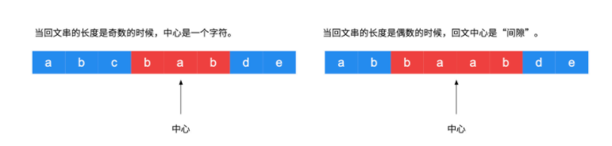
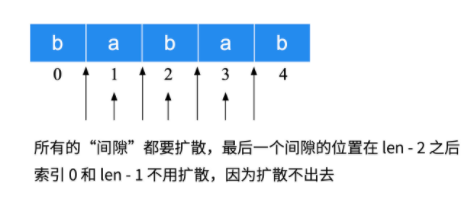

@lc app=leetcode.cn id=5 lang=JavaScript

[5] 最长回文子串

https://leetcode-cn.com/problems/longest-palindromic-substring/description/

algorithms
Medium (24.96%)
Total Accepted:    83.8K
Total Submissions: 317.6K
Testcase Example:  '"babad"'

给定一个字符串 s，找到 s 中最长的回文子串。你可以假设 s 的最大长度为 1000。

示例 1：

输入: "babad"
输出: "bab"
注意: "aba" 也是一个有效答案。


示例 2：

输入: "cbbd"
输出: "bb"

方法一: 暴力匹配
* 根据回文串的定义，枚举所有长度大于等于2的子串，依次判断它们是否是回文, 简答解释一下就是 bab 这种属于回文，bb 这种也属于回文,所以我们只需要枚举所有大于等于2的长度的字符串即可。
* 具体的编码实现阶段，可以只针对大于"当前得到的最长子串长度"的子串进行"回文验证";简单解释一下，就是假设现在已经找出了一个回文串长度是5，再去遍历的时候没有必要看小于5的子串了，即使匹配上了也不会使用。
* 在记录最长回文串的时候，可以只记录"当前子串的起始位置"和"子串长度"，不必做截取操作，这一步在后面进行操作。

> 说明：暴力解法时间复杂度高，但是思路清晰，编写简单，正确性高，可以作为测试用例验证别的解法是否正确，优化的解法在很多时候，都是基于暴力解法的，以空间换取时间来得到的, 因此，学习暴力解法也能拓展自己的解题思路。

代码实现:
```js
var longestPalindrome = function (s) {
  // 取出字符串的的长度。
  let len = s.length;
  // 如果是回文串，必须保证的一点是 这个字符串的长度是大于等于2的
  // 这是对于回文串的定义，也是基本规则
  if (len < 2) {
    return s;
  }
  // 创建两个变量
  let maxLen = 1;
  let begin = 0;
  // 先将字符串转换为数组
  let strArr = s.split('');

  // 枚举所有长度大于1的子串 charArray[i...j];
  // 外层循环中 i 从 0 开始 j 从 1 开始 
  for (let i = 0; i < len - 1; i++) {
    for (let j = i + 1; j < len; j++) {
      // 我们需要的是具体字符串的长度 所以索引相减之后需要+1
      // 回文串必须保证的一点是这个字符串的长度是大于等于2的
      if (j - i + 1 > maxLen && validPalindromic(strArr, i, j)) {
        // 更新一下最大的maxlen，这是一个优化手段，后续的判断中
        // 凡是小于这个长度的不予考虑
        maxLen = j - i + 1;
        // 更新起始位置
        begin = i;
      }
    }
  }
  // 返回截取的字符串
  return s.substring(begin, begin + maxLen);
}

// 验证子串s[left, right] 是否为回文串
function validPalindromic(strArr, left, right) {
  // 使用while循环, 从两边的索引开始向中间移动判断。
  while (left < right) {
    if (strArr[left] !== strArr[right]) {
      return false;
    };
    left++;
    right--;
  }
  return true;
}
```

方法二：中心扩散法

暴力解法采用的双指针两边向中间靠拢的方式，验证是否是回文子串。

除了枚举字符串的左右边界以外，比较容易想到的是枚举可能出现的回文子串的中心位置，从中心位置尝试尽可能的扩散出去，得到一个回文串。

因此，中心扩散法的思路是：遍历每一个索引, 以这个索引为中心, 利用“回文串”中心对称的特点，往两边扩散，看最多能扩散多远。

枚举“中心位置”时间复杂度是O(N),从"中心位置"扩散得到“回文子串”的时间复杂度是O(N),因此时间复杂度可以降低到O(N^2)。

在这里需要注意一个细节: 回文串在长度为奇数和偶数的时候，“回文中心”的形式是不一样的。
* 奇数回文中心是一个具体的字符,例如: 回文串 'aba'的中心是字符 'b';
* 偶数的回文串的中心是位于中间的两个字符的“空隙”。例如：回文串"abba"的中心是两个“b”中间的那个“空隙”。



我们看一下一个字符串可能的回文子串的中心在哪里？



我们可以设计一个方法，兼容以上两种情况:

1、如果传入重合的索引编码，进行中心扩散，此时得到的回文子串的长度是奇数;
2、如果传入相邻的索引编码，进行中心扩散，此时得到的回文子串的长度是偶数;

具体编码细节在代码注释中体现:


