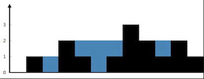

给定 n 个非负整数表示每个宽度为 1 的柱子的高度图，计算按此排列的柱子，下雨之后能接多少雨水。



```
输入：height = [0,1,0,2,1,0,1,3,2,1,2,1]
输出：6
解释：上面是由数组 [0,1,0,2,1,0,1,3,2,1,2,1] 表示的高度图，在这种情况下，可以接 6 个单位的雨水（蓝色部分表示雨水）。
```

示例：

```
输入：height = [4,2,0,3,2,5]
输出：9
```

这里只介绍其中一种比较好的解法: 双指针解法

我们先明确几个变量的含义：

```
left_max: 左边的最大值，它是从左往右遍历找到的
right_max: 右边的最大值，它是从右往左遍历找到的
left: 从左往右处理的当前下标
right: 从右往左处理的当前下标
```
在某个位置i处,它能存的水，取决于它左右两边的最大值中较小的一个，这点很好理解，和木桶原理类似，取决于短板。

当我们从左往右处理left下标时候，左边的最大值left_max对它而言是可信的，但是right_max 对它而言是不可信的, 因为中间没有遍历到的
部分是否有更大的是未知的，对于left下标而言，right_max未必就是它右边最大的值。

当我们从右向左处理right下标时候，右边的最大值right_max对它而言是可信的，但是left_max对它而言是不可信的。

对于位置left而言，它左边的最大值一定是left_max,右边的最大值“大于等于right_max”,这个时候，如果left_max < right_max 成立，那么它就知道自己能存多少水了，无论右边将来会不会出现更大的right_max,都不影响这个结果，所以当left_max<right_max时，我们就希望去处理left下标，反之，我们希望去处理right下标。

代码：
```js
/**
 * @param {number[]} height
 * @return {number}
 */
var trap = function (height) {
  let left = 0;
  let right = height.length - 1;
  let res = 0;
  let leftMax = 0;
  let rightMax = 0;
  while (left < right) {
    if (height[left] < height[right]) {
      leftMax = Math.max(height[left], leftMax);
      res += leftMax - height[left];
      left++;
    } else {
      rightMax = Math.max(height[right], rightMax);
      res += rightMax - height[right];
      right--;
    }
  }
  return res;
};
```

复杂性分析
* 时间复杂度：O(n)。单次遍历的时间O(n)。
* 空间复杂度：O(1)的额外空间。


