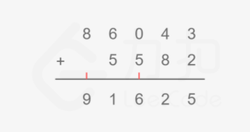

## [LeetCode] 415. Add Strings 字符串相加

给定两个字符串形式的非负整数 num1 和 num2，计算它们的和。

提示:

num1 和num2 的长度都小于 5100
num1 和num2 都只包含数字 0-9
num1 和num2 都不包含任何前导零
你不能使用任何內建 BigInteger 库， 也不能直接将输入的字符串转换为整数形式

方法一：模拟

思路与算法

本题我们只需要对两个大整数模拟 [竖式加法]的过程，竖式加法就是我们平时使用的对两个整数相加的方法，回想一下我们在纸上对两个整数相加的过程，是不是如下图将相同的数位对齐，从低位到高位逐位相加，如果当前位和超过10，则向高位进一位？因此我们只要将这个过程用代码写出来即可。



具体实现也不复杂，我们定义两个指针 i 和 j 分别指向 nums1 和 nums2的末尾，即最低位，同时定义一个变量 add 维护当前是否有进位，然后从末尾到开头逐位相加即可，你可能会想两个数字位数不相同应该如何处理，这里我们统一在指针当前下标处于负数的时候返回0，等价于对位数较短的数字进行了补零操作，这样就可以除去两个数字位数不同情况的处理，具体看下面代码。

```js
var addStrings = function(num1, num2) {
  let i = num1.length - 1; // 最后一个索引
  let j = num2.length - 1;
  let add = 0;
  // 返回的是数组
  const ans = [];
  while(i >= 0 || j >= 0 || add != 0 ) {
    const x = i >= 0 ? num1.charAt(i) - '0' : 0;
    const y = j >= 0 ? num2.charAt(j) - '0' : 0;
    const result = x + y + add;
    ans.push(result % 10);
    add = Math.floor(result / 10);
    i -= 1;
    j -= 1;
  }
  return ans.reverse().join('');
}
```

复杂度分析
* 时间复杂度: len1 = num1.length, len2 = num2.length. 竖式加法的次数取决于较大树的位数
* 空间复杂度: O(1) 除答案外我们只需要常数空间存放若干变量。

